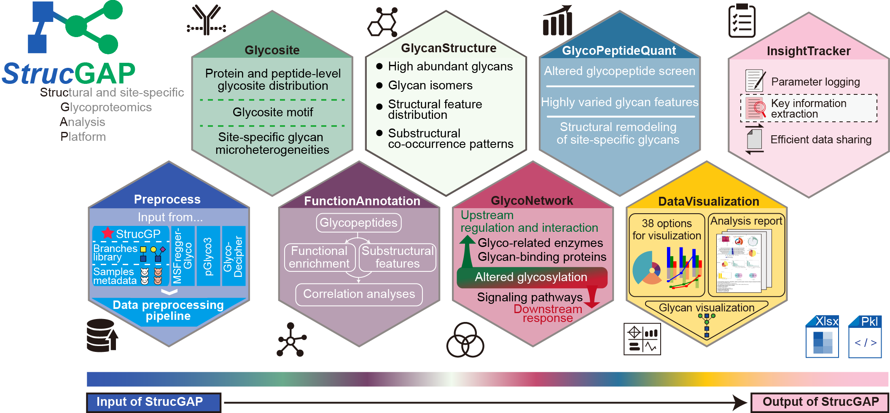

.. StrucGAP documentation master file, created by
   sphinx-quickstart on Wed Apr 30 17:16:43 2025.
   You can adapt this file completely to your liking, but it should at least
   contain the root `toctree` directive.

StrucGAP：Structural and site-specific Glycoproteomics Analysis Platform
==============================================================================================================================

StrucGAP, a pioneering Structural Glycoproteomics Analysis Platform for scalable downstream data mining of site-specific glycoproteomics. It integrates modules for data quality control, overall glycan structural characterization, altered glycan feature extraction, functional annotation, and upstream and downstream interactions and networks. Its visualization and insight-tracking functionalities distill interpretation across hundreds of outputs, uniquely equipped to generate chart-based analysis reports and extract key site-specific N-glycan insights.

.. raw:: html

   

.. raw:: html

   

Manuscript source
----------------------

Please see our manuscript to learn more.

.. toctree::
   :maxdepth: 1
   :caption: GENERAL
   :hidden:

   installation
   get_started

.. toctree::
   :maxdepth: 1
   :caption: MODULES
   :hidden:

   preprocess
   glycanstructure
   glycosite
   glycopeptidequant
   functionannotation
   glyconetwork
   datavisualization
   insighttracker

.. toctree::
   :maxdepth: 1
   :caption: USAGE
   :hidden:

   tutorials

