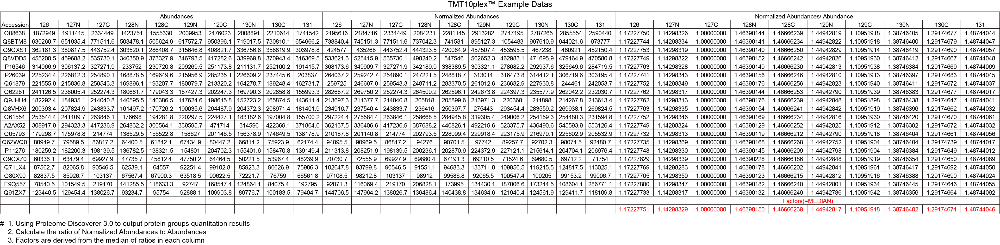

StrucGAP_Preprocess Module
==========================

Overview
-----------

This module processes outputs from StrucGP alongside sample metadata and a glycan branch library through sequential correction and filtering steps, harmonizing heterogeneous data into a unified format.

How to Use
--------------

Instantiate and use the module as follows (All data used for StrucGAP can be found in our GitHub repository(https://github.com/Sun-GlycoLab/StrucGAP)):

The abundance ratio used for the outliers calibration was calculated as follows:

.. raw:: html

   

.. raw:: html

   

.. code-block:: python

    from strucgap.preprocess import StrucGAP_Preprocess
    from strucgap.insighttracker import StrucGAP_InsightTracker

    module1 = StrucGAP_Preprocess(data_dir="tests/mouse uterus.xlsx",
                      data_sheet_name = '1 PSM',
                      sample_group_data_dir = 'tests/sample_group.xlsx',
                      branch_list_dir = "tests/branch_structures_18_mice uterus.0240401.xlsx",
                      data_manager=data_manager)
    module1.data_cleaning(data_type='tmt')
    module1.cv_raw(threshold='no')
    module1.fdr(feature_type='no')
    module1.outliers(abundance_ratio=[1.172277596,1.142983373,1,1.46390136,1.466662624,1.449428354,1.109519196,1.387464059,1.291746761,1.487440464],
                 samplewise_normalization = False, total_intensity_normalization=False, total_intensity_method='mean')
    module1.cv(threshold = 'no')
    module1.psm(psm_number = 'no')
    # Using glytoucan = True and biosynthetic_pathways = True is a very time-consuming task, due to the limitations of the GlyTouCan and KEGG APIs. Please be patient when enabling these two annotations. If you prefer faster execution, set both options to False.
    module1.annotation(glytoucan = True, glytoucan_structure = True, glytoucan_wurcs_file = "tests/glycosmos_glycans_wurcs.csv", biosynthetic_pathways = True, glycobiology_filter = True)
    module1.output() 

API Reference
------------------

.. automodule:: strucgap.preprocess
    :members:
    :undoc-members:
    :show-inheritance:
